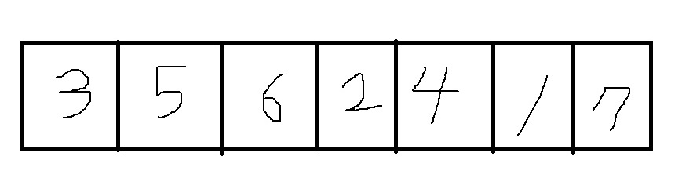
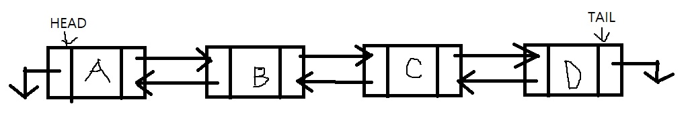
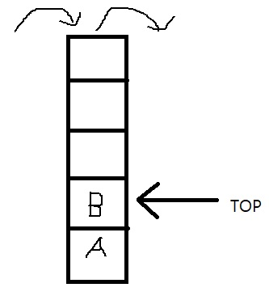
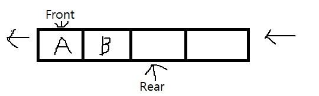
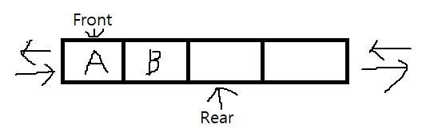

# 선형 자료구조

- - -

 자료를 선형으로 보관하는 자료 구조에는 **배열**, **연결리스트**, **스택**, **큐**, **덱** 등이 있다. 이와 같은 자료구조에 자료를 보관하거나 삭제, 검색 등의 연산을 수행할 때 반복적인 방법으로 해결하는 경우가 많다.  

* * *

**배열**은 자료를 연속적인 메모리에 보관하는 자료구조이다. 이를 순차리스트라고도 부른다.  

* * *

**연결리스트**는 하나의 자료를 보관하는 노드들을 선형으로 그릴 수 있다. 실제 메모리는 순차적이지 않지만 논리적으로 선형으로 나타낼 수 있다. 연결리스트를 구성하는 노드는 하나의 데이터와 링크의 조합이다. 링크는 노드의 위치 정보로 노드에 하나의 링크가 있으면 단순 혹은 단일 연결리스트라 부르고 두 개 있으면 이중 연결리스트라고 부른다.

* * *

이러한 배열과 연결리스트를 이용하여 임시적으로 자료를 보관하거나 꺼내서 사용하는 버퍼 중에 이름이 붙여진 자료구조들이 존재한다. 이러한 것들에는 스택, 큐 그리고 덱이 있다.  

* * *

 **스택**은 한 쪽으로 보관하고 꺼내는 버퍼로 LIFO(Luast In First Out) 방식으로 동작한다.  
 

* * *

 **큐**는 한 쪽으로 보관하고 다른 쪽으로 꺼내는 버퍼로 FIFO(First In First Out) 방식으로 동작한다.  
 

* * *

 **덱**은 양쪽으로 보관하거나 꺼낼 수 있는 버퍼이다.  
 

* * *

- - -
참고: [ehpub.co.kr](http://ehpub.co.kr/3-%EC%84%A0%ED%98%95-%EC%9E%90%EB%A3%8C%EA%B5%AC%EC%A1%B0/)
