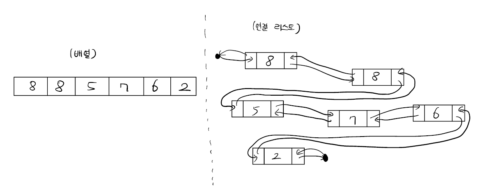
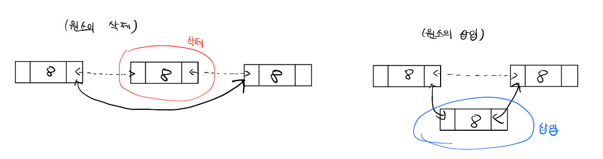

# 연결 리스트

- - -
 배열 원소들의 순서를 유지하면서 임의의 위치에 원소를 삽입하거나, 임의의 위치에서 원소를 삭제하는 것은 시간이 오래 걸리는 작업이다. 해당 위치 뒤에 있는 원소들을 하나씩 뒤칸 혹은 앞칸으로 옮겨야 하기 때문이다.  
 이와 같은 문제를 해결하기 위해 고안된 자료 구조가 **연결 리스트(linked list)**로, 특정 위치에서의 삽입과 삭제를 상수 시간에 할 수 있게 해 준다. 연결 리스트는 배열과 아주 다른 형태를 가지고 있다. 배열에서는 메모리의 연속된 위치에 각 원소들이 저장되어 있다면, 연결 리스트는 원소들이 메모리 여기저기 흩어져 있고 각 원소들이 이전과 다음 원소를 가리키는 포인터를 가지고 있는 방식으로 구현된다.  
  

 연결 리스트에서 사각형으로 표현된 원소와 포인터의 집합들을 리스트의 노드(node)라고 부른다. 예를 들어 정수를 담는 연결 리스트는 다음과 같은 노드 구조체를 사용해 구현할 수 있다.  
```cpp
struct ListNode{
  int element; // 담고 있는 원소
  ListNode *prev, *next; // 이전 노드, 다음 노드의 포인터
}
```  
 연결 리스트는 첫 번째 노드와 마지막 노드에 대한 포인터를 가지고 있는데, 이들을 각각 머리(head)와 꼬리(tail)라고 부른다. 대개 연결 리스트는 이와 같이 머리와 꼬리에 대한 포인터만을 가진 클래스로 구현된다.

- - -
## 연결 리스트 다루기
 배열과는 달리 연결 리스트에서는 메모리 여기저기에 노드들이 흩어져 있기 때문에 특정 위치의 값을 찾기가 쉽지 않다. 연결 리스트에서 i번째 노드를 찾아내려면 리스트의 머리에서부터 시작해 하나씩 포인터를 따라가며 다음 노드를 찾을 수밖에 없다.  
 반면 다른 노드들의 순서를 유지하면서 새 노드를 삽입하거나 기존 노드를 삭제하는 작업은 아주 간단하다. 노드들의 순서가 포인터에 의해 정의되기 때문이다. 다른 노드들은 그대로 두고, 삽입/삭제할 노드와 이전/이후 노드의 포인터만을 바꾸면 된다.  
   

- - -
## 동적 배열과 연결 리스트의 비교  
 동적 배열과 연결 리스트의 가장 큰 차이점은 삽입과 삭제 그리고 임의의 원소에 접근하는 데 드는 시간이다. 삽입과 삭제를 할 일이 없거나, 배열의 끝에서만 하면 될 경우에는 동적 배열이 거의 항상 더 좋은 선택이다. 임의의 원소에 빠르게 접근할 수 있을 뿐더러, 원소들이 메모리에 연속해 배치되어 있다는 점이 CPU 캐시의 효율도 더 높여 주기 때문이다. 만약 임의의 원소를 접근하는 것이 아니라 모든 원소들을 순회하며 삽입과 삭제를 한다면 연결 리스트가 좋은 선택이다.  

- - -

참고: 알고리즘 문제해결 전략
